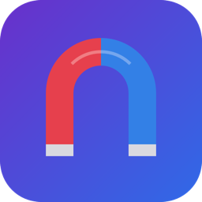

<p align="center">
  
</p>

<h1 align="center">MagnetRelay</h1>

<p align="center">
  <strong>Forward magnet links to your home server with one click</strong>
</p>

<p align="center">
  <a href="#features">Features</a> •
  <a href="#supported-clients">Supported Clients</a> •
  <a href="#installation">Installation</a> •
  <a href="#usage">Usage</a> •
  <a href="#privacy">Privacy</a>
</p>

<p align="center">
  
  
  
</p>

---

<p align="center">
  
</p>

## What is MagnetRelay?

**MagnetRelay** is a lightweight macOS menu bar app that registers as your system's `magnet:` link handler. When you click a magnet link anywhere—in your browser, email, or any app—it's automatically forwarded to your configured download server.

Perfect for:
- 🐧 **Linux distributions** — Download ISOs directly to your NAS
- 📦 **Open source software** — Large releases straight to your server
- 🏠 **Home server users** — No need to keep your Mac running for downloads

## Features

- **One-click setup** — Configure once, works everywhere
- **5 download clients** — qBittorrent, Transmission, Deluge, rTorrent, Synology
- **Menu bar app** — Stays out of your way, always accessible
- **Secure** — Passwords stored in macOS Keychain, never in plain text
- **Privacy-first** — No analytics, no tracking, all data stays local
- **Native macOS** — Built with SwiftUI, feels right at home

## Supported Clients

| Client | Protocol | Status |
|--------|----------|--------|
| **qBittorrent** | REST API v2 | ✅ Fully Tested |
| **Transmission** | JSON-RPC | ✅ Fully Tested |
| **Deluge** | JSON-RPC | ✅ Fully Tested |
| **rTorrent** | XML-RPC | ✅ Fully Tested |
| **Synology Download Station** | REST API | ✅ Fully Tested |

## Installation

### From Source

```bash
# Clone the repository
git clone https://github.com/pgpillar/MagnetRelay.git
cd MagnetRelay

# Generate Xcode project
xcodegen generate

# Build
xcodebuild -project MagnetRelay.xcodeproj -scheme MagnetRelay build

# Install
cp -r ~/Library/Developer/Xcode/DerivedData/MagnetRelay-*/Build/Products/Debug/MagnetRelay.app /Applications/
```

### Requirements

- macOS 13.0 (Ventura) or later
- [XcodeGen](https://github.com/yonaskolb/XcodeGen) (for building from source)

## Usage

1. **Launch** MagnetRelay from your Applications folder
2. **Configure** your download client (host, port, credentials)
3. **Test** the connection to verify everything works
4. **Click** any magnet link — it's automatically sent to your server!

<p align="center">
  
</p>

### Menu Bar

MagnetRelay lives in your menu bar. Click the icon to:
- View recent magnet links
- Resend a previous magnet
- Open settings
- Quit the app

## Privacy

**MagnetRelay does not collect any data.**

- ✅ No analytics or tracking
- ✅ No network calls except to your configured server
- ✅ All settings stored locally on your Mac
- ✅ Passwords secured in macOS Keychain

Read our full [Privacy Policy](PRIVACY.md).

## Building

This project uses [XcodeGen](https://github.com/yonaskolb/XcodeGen) to generate the Xcode project.

```bash
# Install XcodeGen (if needed)
brew install xcodegen

# Generate project
xcodegen generate

# Open in Xcode
open MagnetRelay.xcodeproj
```

## Contributing

Contributions are welcome! Please feel free to submit a Pull Request.

## License

This project is licensed under the MIT License - see the [LICENSE](LICENSE) file for details.

---

<p align="center">
  Made with ❤️ for the home server community
</p>
